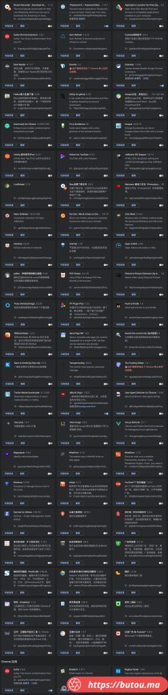
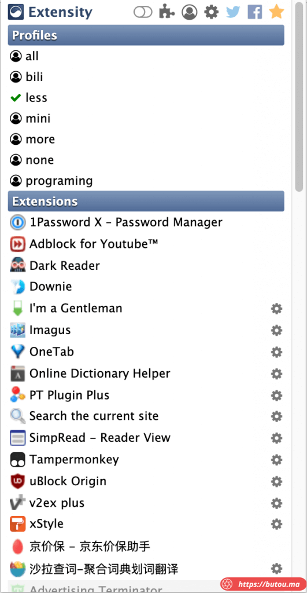

> 第一次使用谷歌浏览器是刚上高中时，距现在已有十年了。  
> 自从知道 Chrome 有自己的应用商店可以安装各种功能的扩展后，就基本没换过其他浏览器了。  
> 十年间用过无数扩展，感觉有必要写篇文章推荐下最终留下来的这些。  
> **某些扩展功能比较冷门，下面只介绍比较通用的。**  
> **Tampermonkey 油猴扩展作为脚本管理器比较特殊，会单独写一篇进行介绍和推荐对应的脚本。**

所有扩展截图（[查看大图](IMG_6324AB00274A-1.jpeg)）
-----------------------------------------------------------------------------------

必装扩展推荐（点击名称可跳转到应用商店页面）
----------------------

[Extensity](https://chrome.google.com/webstore/detail/extensity/jjmflmamggggndanpgfnpelongoepncg)

*   管理扩展的扩展。
*   扩展装的太多后，会拖慢电脑运行速度，某些扩展只是特定场景使用，所以有必要用一个管理器进行管理。
*   界面简洁，支持分组和一键关闭或启用单个及某组扩展。

[Tampermonkey](https://chrome.google.com/webstore/detail/tampermonkey/dhdgffkkebhmkfjojejmpbldmpobfkfo)

*   专门管理和运行 JS 脚本的扩展，非常强大。
*   需配合各种脚本使用，所以会单写一篇介绍。

[Dark Reader](https://chrome.google.com/webstore/detail/dark-reader/eimadpbcbfnmbkopoojfekhnkhdbieeh)

*   可以为那些不支持黑暗模式的网站自动生成黑暗模式配色，也可以在 UI 界面自定义黑暗效果。
*   专业用户还可以编辑 css 文件针对不同网站进行定制。

[uBlock Origin](https://chrome.google.com/webstore/detail/ublock-origin/cjpalhdlnbpafiamejdnhcphjbkeiagm)

*   网页广告拦截器。
*   优点是内存和 CPU 占用低（相比于其他同类扩展）。

[Imagus](https://chrome.google.com/webstore/detail/imagus/immpkjjlgappgfkkfieppnmlhakdmaab)

*   看图利器
*   鼠标悬停在图片上时，会自动弹出分辨率更高的原图，不需要额外点击。

[OneTab](https://chrome.google.com/webstore/detail/onetab/chphlpgkkbolifaimnlloiipkdnihall)

*   打开太多的标签页时，单击 OneTab 图标，一键将所有标签页转换成一个列表。
*   需要再次访问这些标签页时，也可以单独或全部一键恢复。

[xStyle](https://chrome.google.com/webstore/detail/xstyle/hncgkmhphmncjohllpoleelnibpmccpj)

*   可以为各种网站创建 css 文件进行页面样式定制
*   同类软件有 Stylus，这款 UI 更现代些。
*   样式文件可以去专门网站安装，有很多网友共享的
    *   比如 [https://userstyles.org](https://userstyles.org/)

[I’m a Gentleman](https://chrome.google.com/webstore/detail/im-a-gentleman/afjaicccalbbickikgdegaihmajaidpd)

*   鼠标在图片上拖拽，就能保存图片到本地。比右键点保存更快。

[简悦 – SimpRead](https://chrome.google.com/webstore/detail/simpread-reader-view/ijllcpnolfcooahcekpamkbidhejabll)

*   排除多余元素，将网页文本重排，瞬间进入沉浸式阅读模式。
*   类似 Safari 的阅读模式, 但更强大。
*   支持各种主题。

[云盘万能钥匙](https://butou.ma/2019/09/11/%e4%b8%aa%e4%ba%ba-chrome-%e6%89%a9%e5%b1%95%e6%8e%a8%e8%8d%90/[https://chrome.google.com/webstore/detail/%E4%BA%91%E7%9B%98%E4%B8%87%E8%83%BD%E9%92%A5%E5%8C%99/anlllmnpjodopgbkbpnghnjlelnogfjc](https://chrome.google.com/webstore/detail/%E4%BA%91%E7%9B%98%E4%B8%87%E8%83%BD%E9%92%A5%E5%8C%99/anlllmnpjodopgbkbpnghnjlelnogfjc))

*   自动填写百度网盘 & 蓝奏云提取密码。
*   自动检测百度网盘 & 蓝奏云分享链接的状态是否有效。

[Search the current site (站内搜索)](https://chrome.google.com/webstore/detail/search-the-current-site/jliolpcnkmolaaecncdfeofombdekjcp)

*   使用 Google 等搜索引擎提供当前浏览网站的站内搜索功能。
*   其实就是省去了自己填写 site: 关键词的作用。

[pakku：哔哩哔哩弹幕过滤器](https://butou.ma/2019/09/11/%e4%b8%aa%e4%ba%ba-chrome-%e6%89%a9%e5%b1%95%e6%8e%a8%e8%8d%90/[https://chrome.google.com/webstore/detail/pakku%EF%BC%9A%E5%93%94%E5%93%A9%E5%93%94%E5%93%A9%E5%BC%B9%E5%B9%95%E8%BF%87%E6%BB%A4%E5%99%A8/jklfcpboamajpiikgkbjcnnnnooefbhh](https://chrome.google.com/webstore/detail/pakku%EF%BC%9A%E5%93%94%E5%93%A9%E5%93%94%E5%93%A9%E5%BC%B9%E5%B9%95%E8%BF%87%E6%BB%A4%E5%99%A8/jklfcpboamajpiikgkbjcnnnnooefbhh))

*   过滤 B 站 (bilibili.com) 的刷屏弹幕。
*   将同样内容弹幕合并。
*   进度条上显示弹幕密度图。

[View Image](https://chrome.google.com/webstore/detail/view-image/jpcmhcelnjdmblfmjabdeclccemkghjk)

*   重新添加 Google 图片结果页面的 “查看图片” 和“以图搜图”按钮。
    *   这两个按钮以前一直有，后来由于版权考虑，Google 给去掉了。

[京价保 – 京东价保助手](https://butou.ma/2019/09/11/%e4%b8%aa%e4%ba%ba-chrome-%e6%89%a9%e5%b1%95%e6%8e%a8%e8%8d%90/[https://chrome.google.com/webstore/detail/%E4%BA%AC%E4%BB%B7%E4%BF%9D-%E4%BA%AC%E4%B8%9C%E4%BB%B7%E4%BF%9D%E5%8A%A9%E6%89%8B/gfgkebiommjpiaomalcbfefimhhanlfd](https://chrome.google.com/webstore/detail/%E4%BA%AC%E4%BB%B7%E4%BF%9D-%E4%BA%AC%E4%B8%9C%E4%BB%B7%E4%BF%9D%E5%8A%A9%E6%89%8B/gfgkebiommjpiaomalcbfefimhhanlfd))

*   自动为你申请京东价格保护，自动签到领京豆、钢镚。
*   很实用，因为京东的价格保护不是自动触发的，需要自己手动去申请

[猫抓](https://butou.ma/2019/09/11/%e4%b8%aa%e4%ba%ba-chrome-%e6%89%a9%e5%b1%95%e6%8e%a8%e8%8d%90/[https://chrome.google.com/webstore/detail/%E7%8C%AB%E6%8A%93/jfedfbgedapdagkghmgibemcoggfppbb](https://chrome.google.com/webstore/detail/%E7%8C%AB%E6%8A%93/jfedfbgedapdagkghmgibemcoggfppbb))

*   网页媒体嗅探工具, 比如 mp3 文件，视频文件。
*   但适用网页不多，需和更强大的脚本配合。
    *   比如 SaveFrom.net 提供的脚本，支持各类网站 YouTube Instagram 等（此脚本需配合油猴使用）。

[Grammarly for Chrome](https://chrome.google.com/webstore/detail/grammarly-for-chrome/kbfnbcaeplbcioakkpcpgfkobkghlhen)

*   著名语法纠正软件的 Chrome 版。
*   能监测输入框内容的语法错误或表达瑕疵，并提供修改建议。

[Saladict 沙拉查词](https://butou.ma/2019/09/11/%e4%b8%aa%e4%ba%ba-chrome-%e6%89%a9%e5%b1%95%e6%8e%a8%e8%8d%90/[https://chrome.google.com/webstore/detail/%E6%B2%99%E6%8B%89%E6%9F%A5%E8%AF%8D-%E8%81%9A%E5%90%88%E8%AF%8D%E5%85%B8%E5%88%92%E8%AF%8D%E7%BF%BB%E8%AF%91/cdonnmffkdaoajfknoeeecmchibpmkmg](https://chrome.google.com/webstore/detail/%E6%B2%99%E6%8B%89%E6%9F%A5%E8%AF%8D-%E8%81%9A%E5%90%88%E8%AF%8D%E5%85%B8%E5%88%92%E8%AF%8D%E7%BF%BB%E8%AF%91/cdonnmffkdaoajfknoeeecmchibpmkmg))

*   界面美观，功能强大。
*   涵盖中英日韩法德西语，支持划词操作、网页翻译、生词本、PDF 查词。

[在线词典助手](https://chrome.google.com/webstore/detail/online-dictionary-helper/lppjdajkacanlmpbbcdkccjkdbpllajb)

*   查词功能上比沙拉查词弱。
*   特色功能是支持连接桌面端 Anki 客户端，实现一键将单词制作成 Anki 卡片。

[单词发现者](https://chrome.google.com/webstore/detail/words-discoverer-expand-y/noncaeikjgpbdeoocblijjgegnobogib)

*   高亮显示网页上的英文生词。
*   可以直接导入熟词库。

先写这些，剩下的在文首截图里有，可以根据截图上的自带介绍判断是否符合自己需要。