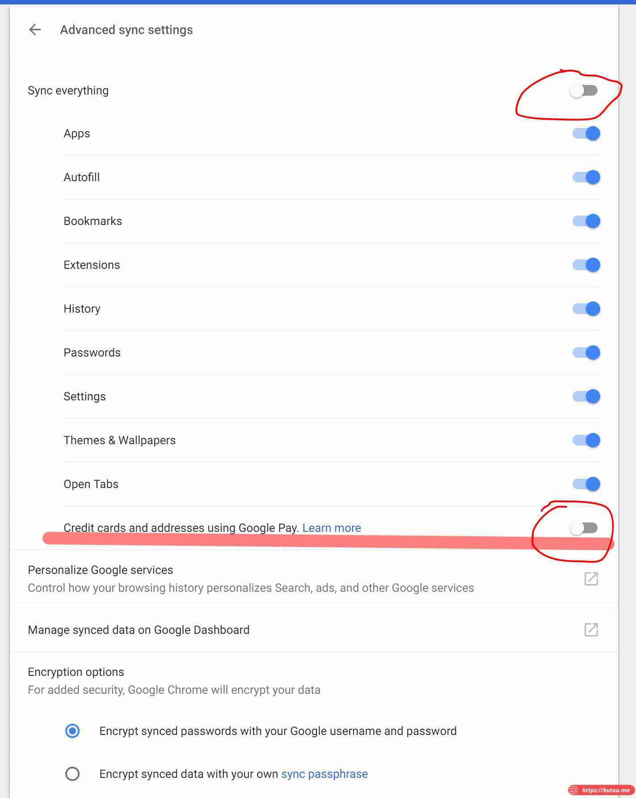

> **_update：经测试，69 beta 版 Chrome 已解决此问题_**  

##### **近日把旧的 Google 账号上的资料迁移到新账号上，迁移相册邮件等都没遇到啥问题，最后在同步浏览器数据时一直成功不了。**

*   退出旧账号的同时保留数据在 pc 端，然后登陆新账号，pc 端的本地数据会上传到新账号上，通过  https://chrome.google.com/sync?hl=en-US  能够查询到已经全部上传至服务器端。
*   此时我用其他设备（MacBook Pro 和 安卓手机端） Chrome 登陆新账号后，始终不能把服务器端数据同步到本地。
*   **尝试各种方法后，在论坛上找到了解决方法：**
    *   打开同步选项，先关闭同步所有选项，再手动分别打开各个同步项，除了最后那个 “Credit cards and addresses using Google Pay”。
    *   然后就能顺利同步了，具体原理不清楚，估计是 Google Pay 的同步逻辑与 Chrome 有冲突。
*   论坛链接：[https://productforums.google.com/forum/#!topic/chrome/JLsH2Aeg9\_Y](https://productforums.google.com/forum/#!topic/chrome/JLsH2Aeg9_Y)

