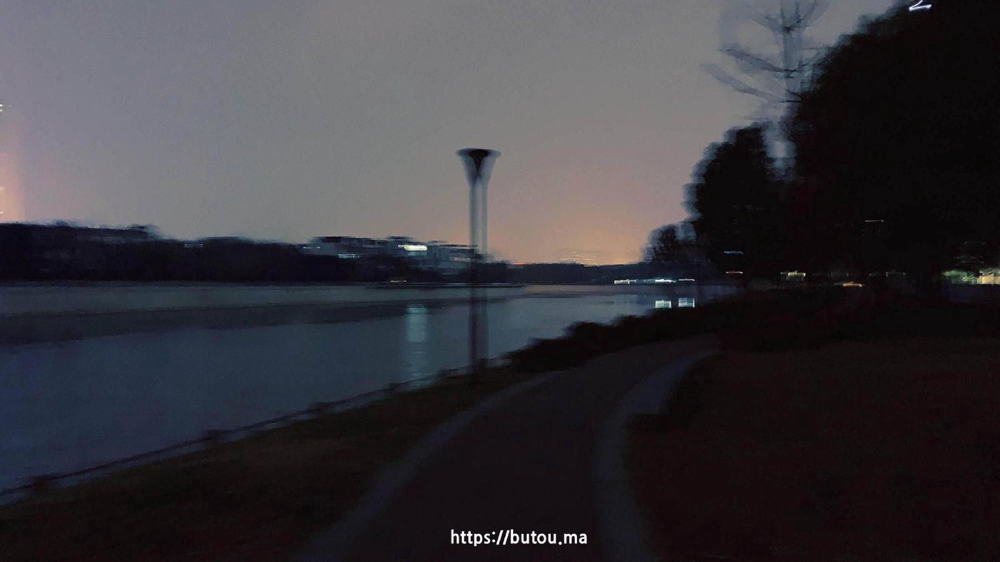

#### **容器技术 Docker 里有种特殊镜像叫 dangling image , 虚悬镜像。指那些失去了标签和名字但依然存在的镜像。**

- 工作用的 Mac 上经常会用 Docker 进行测试，偶尔手动清理下会发现一大堆被遗忘的 dangling image。 每次看到这些镜像我都会联想到现实，感觉自己的生活也时常处于 dangling 状态，没有明确的方向，存在感很弱。
- 试图回忆最近生活里记忆深刻的画面，发现一片空白。反倒经常想起前两年创业时的经历，当时经常熬夜加班， 没赚到钱还一直亏钱。但显然当时的生活是很充实的。
- 相对于虚悬镜像，还有从仓库拉取别人测试过能运行，预定义了标签和名称的镜像。
- 人作为社会性动物，在成长过程中也会被环境塑造，被定义不同的标签。仿佛人生就得像容器那样遵循这些预定目标运行，然而这些标签很多更像是人生的枷锁，把我们困在里面，逐渐异化。旧容器生命周期到达后，新容器依然会根据同样的镜像重启。相似的剧情在一代代人身上重演。
- 上面两种生活一种没有方向，另一种是被他人或社会塑造的方向。
- 第三种是选择自己构建镜像，标签名称运行目标都能自定义，风险是有可能运行失败，就算运行成功也不一定结果就更美好，可能运行效率还没有从仓库直接拉取的高。但构建的过程或许能让自己更接近生活的本质。

人生如梦，我们仍在故事的中途，希望每个人都能早日构建出属于自己的叙事。
