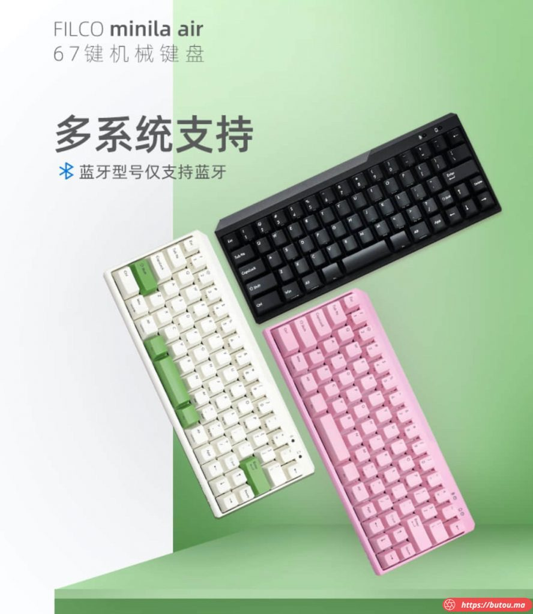
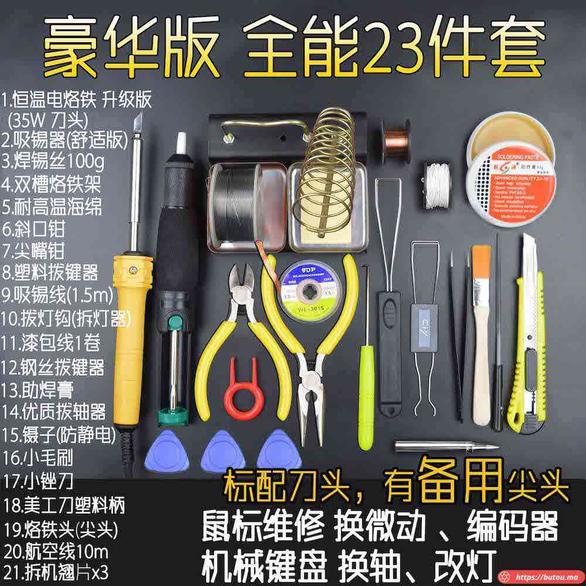
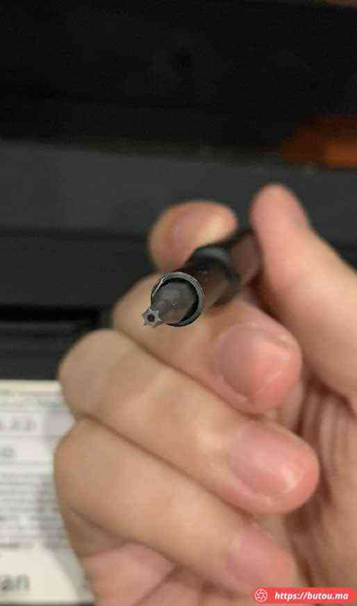
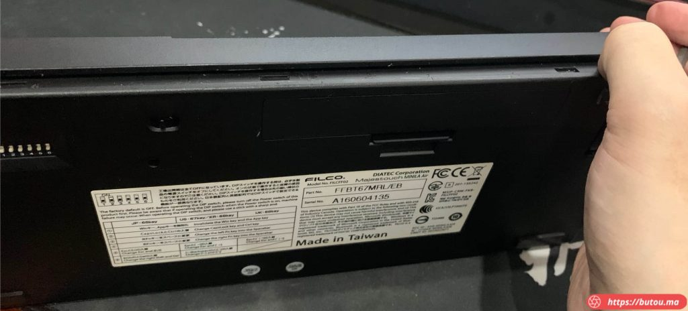
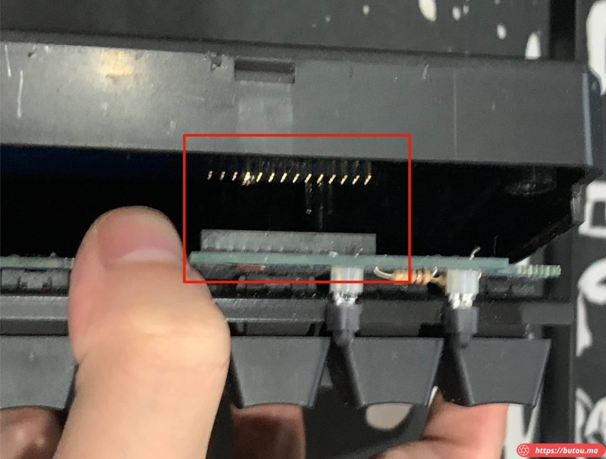
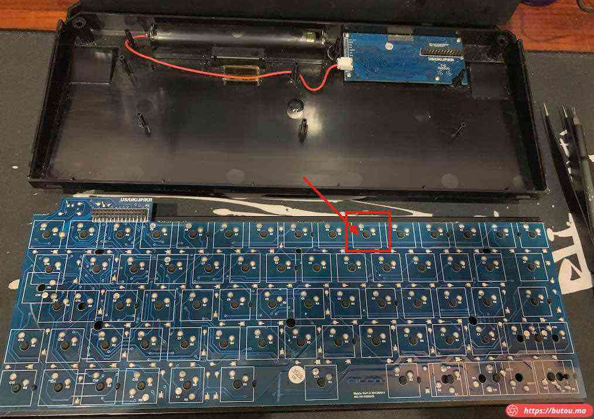
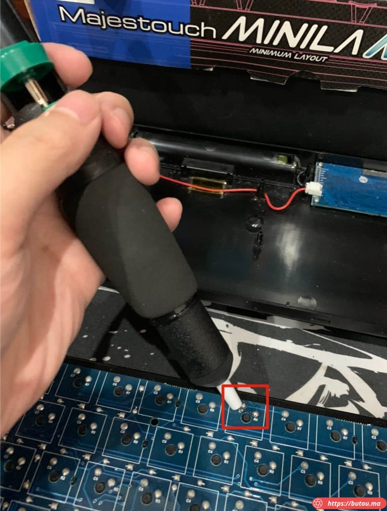
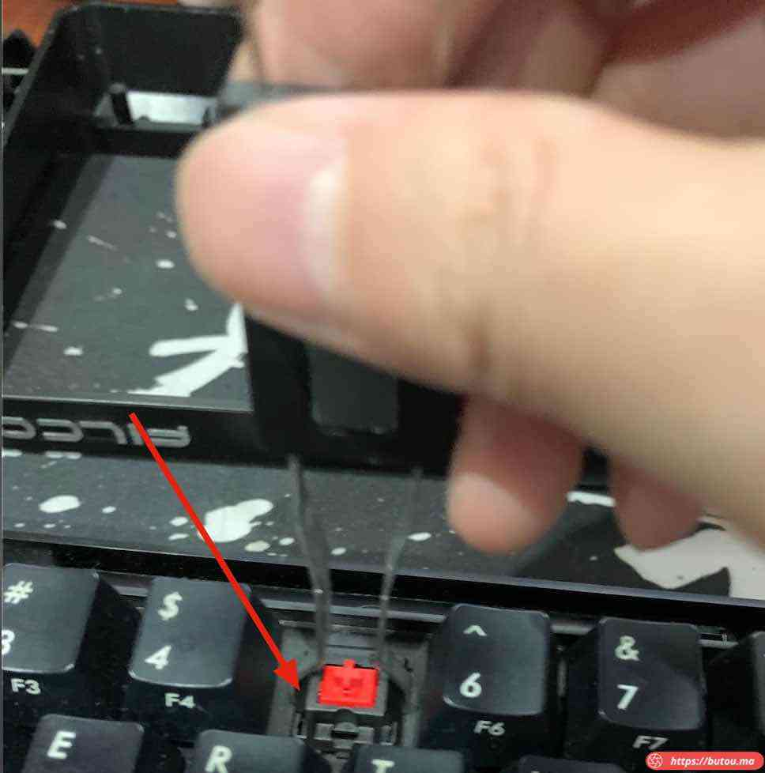

*   我目前用的是 filco 的 minila 系列红轴机械键盘（只有蓝牙模式）。

**两年多前买的。前段时间感觉灰尘有点多，把键帽拆下来清了一下灰。几天后发现数字 5 键有点失灵，然而已过两年保修期了。**

*   上淘宝一看。有对应的维修服务，但感觉邮过去再等店家修好邮回来时间周期太长，还不如自己买工具修。
*   一查资料，filco 的轴是焊在电路板上的，需要电烙铁之类的工具，所以顺便网购了一整套工具（新轴也在这家店买的）。这套小工具既能修键盘也能修其他鼠标之类的数码产品。

### 维修过程

*   先把背面两颗螺丝卸下来。
*   螺丝刀对应的是六角的头。

*   用撬棒或者撬片之类片状的物体把卡扣撬开，就能卸下后盖。

接下来这步要小心，轴体电路板和蓝牙控制板之间是用针式接口连接，要垂直拔掉，拧的幅度别太大，容易拧坏。

*   分离成功后就能看到整体板子的布局。
*   每个轴体有两个针脚跟电路板连接，直接焊接上去的。

*   用电烙铁熔化原本的锡。融化过程中可以用吸锡带或者吸锡器辅助。

*   融化完用拔轴器将坏轴拔下来。

*   焊接上新买的樱桃红轴。 测试是否正常工作，再安装好后盖。
*   有意向购买 filco 键盘的朋友，推荐买蓝牙有线双模版。纯蓝牙版厚度相对略厚。有 USB 接口适用场景更广。
