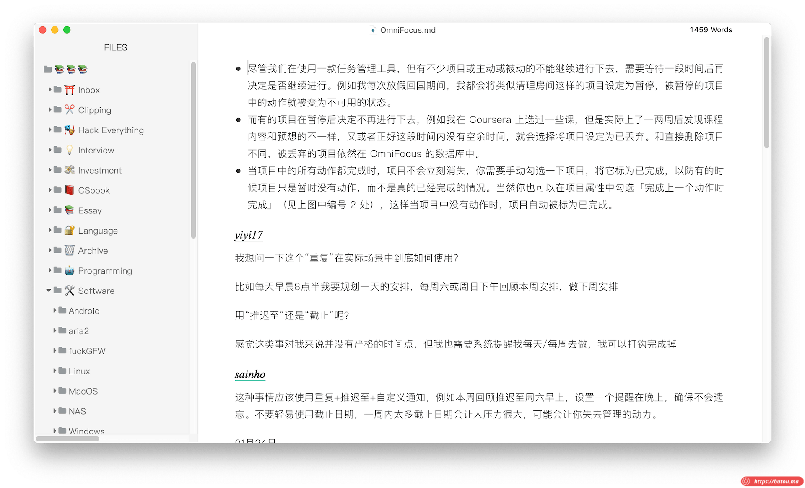
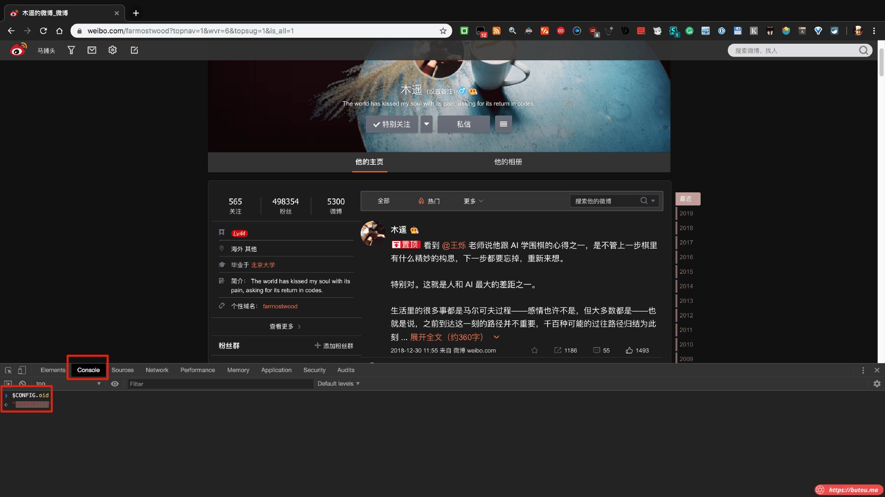
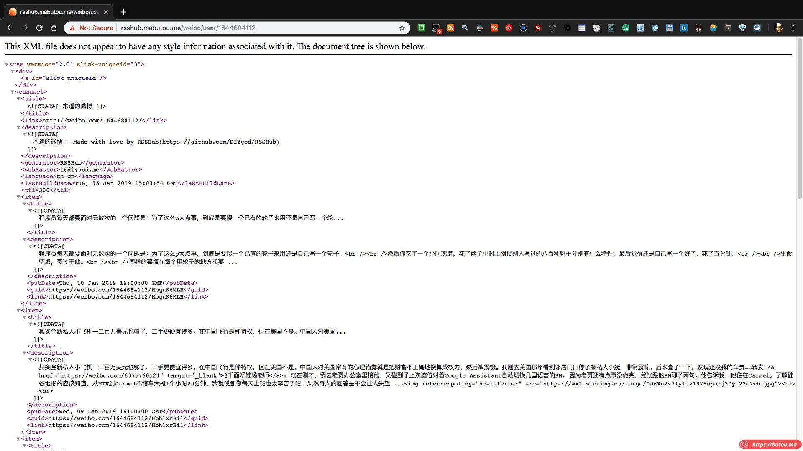
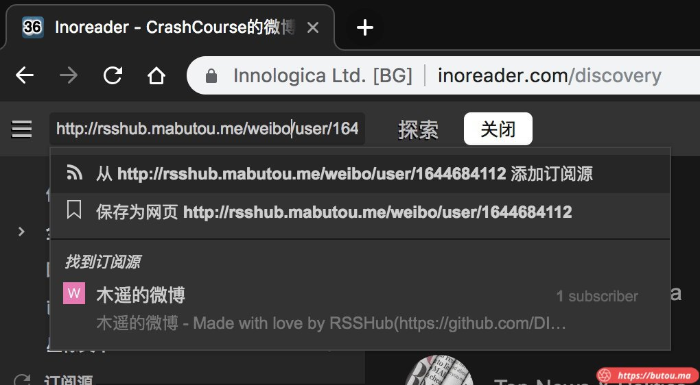
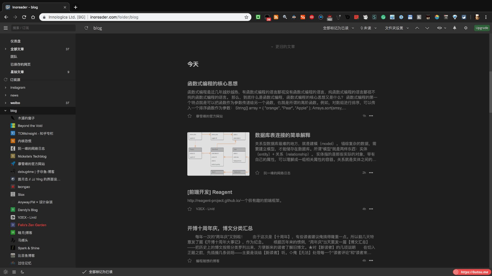
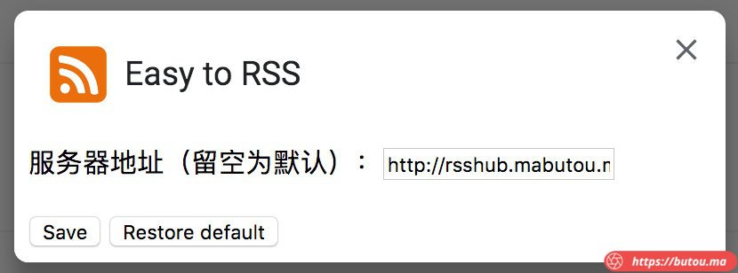
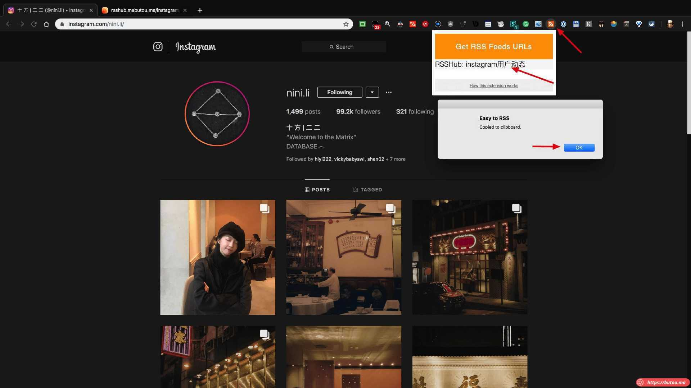
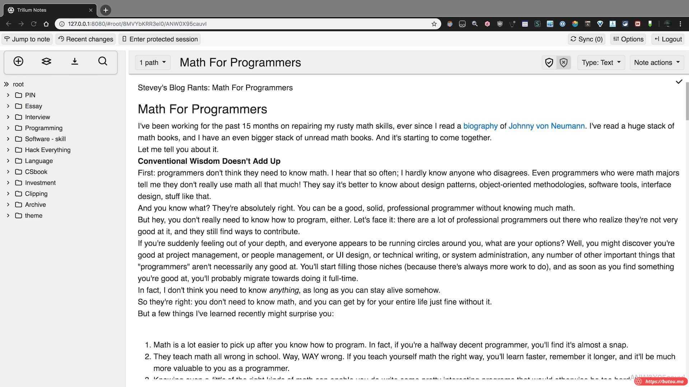

_**21.01.04 update:**_

- _**已切换为 Rsshub + Freshrss + Reeder + Pocket + Notion 方案，有空时重新写一版。**_

_**19.10.05 update:**_

1\. 之前在服务器端部署的 _ttrss_ 用一段时间后感觉太臃肿，已更换为轻量级的 **_Miniflux_**，直接用 _Docker_ 部署在 _nas_ 上的。支持 **_Reeder_** ，安装过程也更简单。

[_https://github.com/miniflux/miniflux_](https://github.com/miniflux/miniflux)

2\. 迫于 **_Typora_** 一直没有 _iOS_ 端，笔记应用迁移到 _**Notion**_ ，目前有教育优惠，用教育版邮箱注册直接免费。

3\. **_Typora_** 里 md 文件有点多。迁移到 _**Notion**_ 时，直接导入会造成 md 文件内引用的本地图片丢失。所以先用命令行工具 **_pandoc_** 批量转换为 docx 格式文件。再导入 _**Notion**_。**_pandoc_** 转换文档时可以指定 css 文件进行样式渲染。

4\. 由于 md 文件散布在不同文件夹，写了个 bash 脚本进行批量汇总及转换。

汇总脚本详情见博文：_[小脚本-批量复制指定目录下特定类型文件](/posts/macos小脚本/)_

汇总 + 转换 + 保留文件夹层级功能脚本点此下载：[_pandoc.sh_](/pandoc.sh)

Notion 界面简洁，功能也挺强

_19.08.14 update:_

1\. 文内提到的 RSSHub 的开发者已开发了对应的 Chrome 扩展，可以直接检测页面是否支持 RSS，并一键订阅到阅读器。[https://github.com/DIYgod/RSSHub-Radar](https://github.com/DIYgod/RSSHub-Radar)

2\. RSS 阅读器 Inoreader 转为付费的 Reeder 4。并链接到服务器端部署的 ttrss（开源的，支持过滤器）。

3\. 笔记应用 Trilium 已放弃，转移到 Mac 端的 Typora，配合 Google Drive 进行 markdown 文件和图片文件同步。

正文：
---

_**“世间好物不坚牢 彩云易散琉璃碎”**_

美好的事物不能永恒存在，自然状态下世间万物总是会从有序到无序，为何如此?

根据热力学第二定律，封闭系统最终都会趋向混乱度最大的状态，除非外部注入能量。

也就是说如果没有外力介入，**事物永远向着更混乱的状态发展**。

衡量混乱程度的指标叫熵。一种悲观假设是当熵的量增加到极限，宇宙会进入热寂，到达虚无。

为了让一个系统保持有序，我们必须付出额外代价。注入外部能量来抵抗熵的增加。

互联网让获取信息的渠道爆发性增长，其中伴随着大量噪音信息。如果不进行筛选和取舍，信噪比会逐步降低。最终吸收的大部份都是垃圾。

身处比特洪流，未免时有迷茫。

本文是个人面对这种情形的一种尝试，供参考。

输入
--

我平时获取信息的主要渠道有：

1.  微博
2.  Twitter
3.  Youtube
4.  V2ex
5.  Instagram
6.  微信公众号（过于封闭，已基本放弃）
7.  各种播客
8.  各种博主的个人博客（主要 IT 领域有几十个）
9.  国内外科技网站：如 少数派、Endgnet 等
10.  Telegram 各种群（垃圾信息挺多，偶尔看）

### 聚合方案

使用 Rsshub +Inoreader 将各种渠道的关键信息筛选后汇总。

以上渠道除了博客和新闻网站，基本不提供原生 rss 订阅。

所以得自己动手。

#### 第一步 制作 RSS 源

*   RSSHub 是一个轻量、易于扩展的 RSS 生成器, 可以给各种奇奇怪怪的内容生成 RSS 订阅源。
    *   github 地址：[https://github.com/DIYgod/RSSHub](https://github.com/DIYgod/RSSHub)
*   主要功能是将一些本来不提供 RSS 的信息源制作成 RSS 源。比如微博和 Instagram。
*   已部署至个人服务器，欢迎使用： [https://rsshub.butou.ma](http://rsshub.butou.ma/)
*   使用方法很简单参考官方文档：[https://docs.rsshub.app](https://docs.rsshub.app/)

例：比如制作 木遥 微博的订阅源

1.  打开目标微博主页
2.  打开网页开发工具，控制台输入 $CONFIG.oid

1.  复制得到的用户 id 1400854834，拼接成对应 url ：[http://rsshub.butou.ma/weibo/user/1400854834](http://rsshub.butou.ma/weibo/user/1400854834)
2.  浏览器如能成功访问此网址，则对应的 RSS 源就生成成功了。

#### 注：有些渠道比较简单，如 instagram。直接用 id 拼接成对应 rss 地址即可。

_以长泽雅美 ?masami\_nagasawa 为例：https://rsshub.butou.ma/instagram/user/masami\_nagasawa_

#### 第二步 订阅和阅读 RSS

*   rss 客户端有很多款，推荐 inoreader
*   inoreader 是一款很优秀的 RSS 阅读客户端。
    *   提供网页端和移动端。
*   即使免费用户也有很完善的体验。
    *   缺点是免费版不支持过滤，可通过 rsshub 增加 url 过滤参数实现，参考使用文档。
*   地址： [https://www.inoreader.com](https://www.inoreader.com/)
*   将第一步制作好的 RSS 地址添加进去就行。
*   很多个人博客和媒体网站都原生提供 RSS ，不用自己制作。

#### 最终效果

#### 备注 1

*   可配合 chrome 插件 Easy-to-RSS 直接获取或生成当前页面的 RSS 地址。
*   安装地址 [https://chrome.google.com/webstore/detail/easy-to-rss/hbcmpkcpbnecinpngdnfbnknfkdpdfli](https://chrome.google.com/webstore/detail/easy-to-rss/hbcmpkcpbnecinpngdnfbnknfkdpdfli)
*   github：[https://github.com/idealclover/Easy-to-RSS](https://github.com/idealclover/Easy-to-RSS)

1.  如果该网站自带 RSS，Easy-to-RSS 将获取该网站自带 RSS
2.  如果该网站被 [RSSHub](https://github.com/DIYgod/RSSHub) 收录，Easy-to-RSS 将获取该网站在 RSSHub 中的地址：

*   安装好后最好在配置页面把服务器地址改成自己的。

#### 备注 2

*   Inoreader 可与 [http://reabble.com/](http://reabble.com/) 联动，实现在 kindle 上阅读的同时重新排版。
*   reabble 本质上是通过登录 Inoreader 帐号，获取到里面的内容后进行二次排版，专门针对电子墨水屏设备优化。
*   效果如图：

输出
--

信息流里有些值得记录的信息，需要手动进行整理与归档。方便查阅或回顾。

*   以前的办法：

1.  加浏览器书签（缺点明显，保存的只是链接，有失效风险）。
2.  用笔记软件记录。

*   尝试过各类笔记应用，都不太满意。
*   印象笔记
*   优点：用户量大，可以跟很多第三方应用联动。
*   缺点：软件臃肿，免费用户流量限制，设备数限制。　
*   onenote
*   优点：编辑功能强大，排版自由度高。
*   缺点：同步很不稳定。
*   notion
*   界面美观。编辑功能比较有特色。
*   导入与迁移不方便。
*   还用过一些，反正都不喜欢。核心缺点都是不能方便的备份数据为通用格式。

*   后来转向开源的个人wiki系统。主流的那几个全都试了下，不是太简陋就是太复杂，易用性很一般。

**最终用的是 Trilium [https://github.com/zadam/trilium](https://github.com/zadam/trilium)**

一款开源知识库软件。

*   界面简洁

*   支持导入导出各种格式笔记。html markdown等

*   支持印象笔记导入

*   无限笔记层级

*   有客户端

*   支持部署到本地电脑或个人服务器，然后通过浏览器访问

*   本地数据可与服务器保持同步。

*   有帐号系统（但较弱）

*   编辑模式支持各种代码格式

*   支持自定义主题

检索
--

应对”知识爆炸”，大脑只需记住核心的知识点，舍弃边缘的知识点。

碎片化信息流获取的信息大多是边缘知识，不需要刻意记忆，在需要的时候临时通过搜索引擎或者个人 wiki 检索就行（trlium 有全文搜索功能）。

通过以上步骤的循环积累，个人知识库会逐渐成体系，能大幅增强检索边缘化知识的效率。

**在这个变幻的世界，为避免思维僵化，我们需要走出舒适区不断引入新的知识维度，理解很多看似矛盾对立的现实，最终穿越生活的迷雾构建属于自己的多维度思维模型。**

**道阻且长, 行则将至。各位共勉。** 