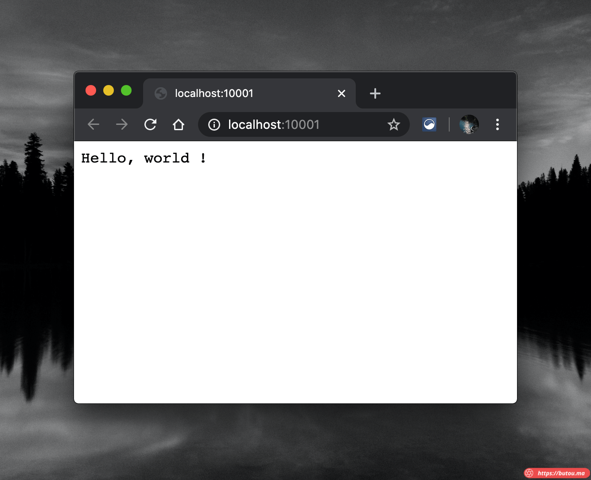

**_exe 下载链接： [winport.exe](/winport.exe)_**

偶尔需要测试某台主机的端口的防火墙策略是否生效，需要在机器上临时启动对应端口。

Linux 和 macOS 上都能用 netcat 很方便的用一条命令启动一个本地端口。 比如 1081 端口：

```
nc -l 1081
```

但在 Windows 平台没有预装 netcat , 找了几个安装包，使用起来也有问题。

就用 go 写了个小程序，通过启动参数自定义端口，在对应端口上启动一个 http 服务。

winport.go 代码：

```
package main

import (
	"fmt"
	"net/http"
	"flag"
)
var cliport = flag.Int("p", 8888, "please input port")

func main() {
	flag.Parse()
	http.HandleFunc("/", HelloServer)
	http.ListenAndServe(fmt.Sprintf(":%d", \*cliport), nil)
}

func HelloServer(w http.ResponseWriter, r \*http.Request) {
	fmt.Fprintf(w, "Hello, %s!", r.URL.Path\[1:\])
}
```

编译为 exe 程序

```
GOOS=windows GOARCH=amd64 go build -o winport.exe winport.go
```

比如要测试 10001 端口，对应命令：

```
winport.exe -p=10001
```

浏览器打开 http://localhost:10001 , 应该能看到如下界面。



然后就可以开始测试了。