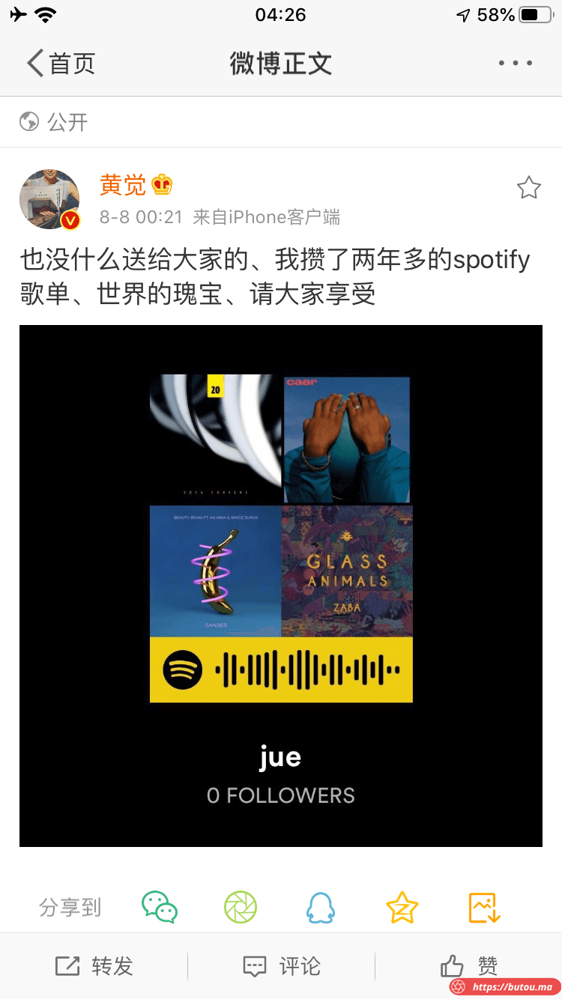
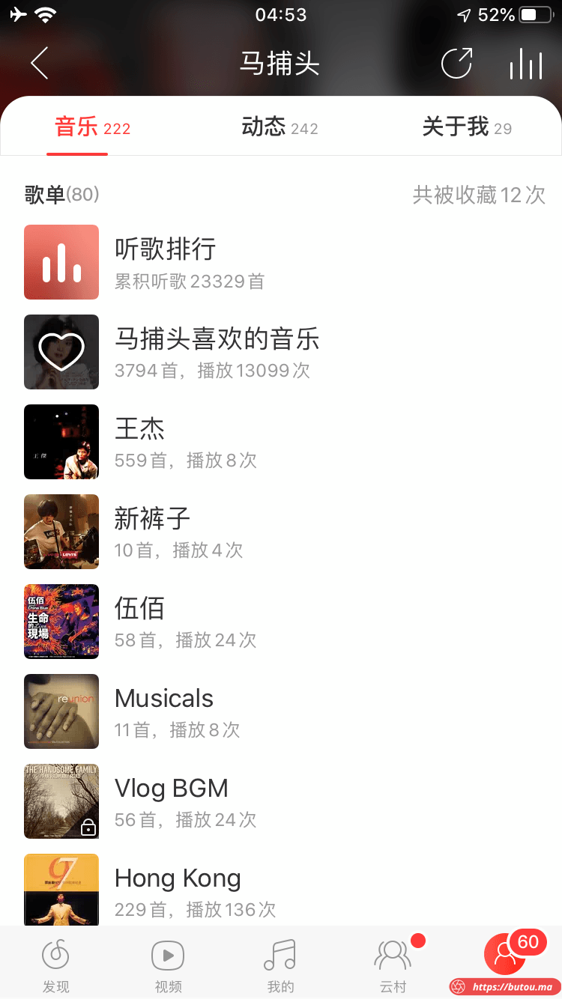
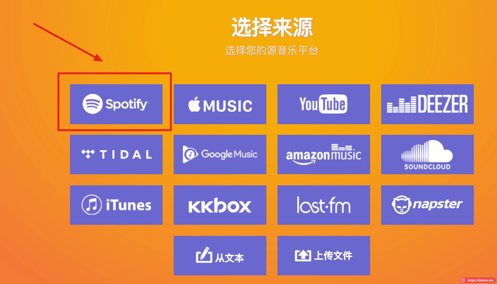
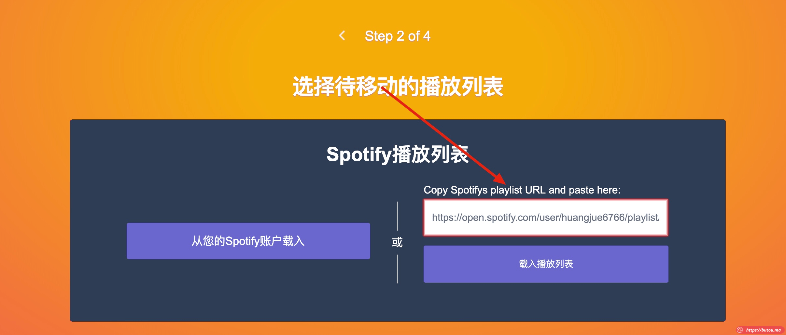
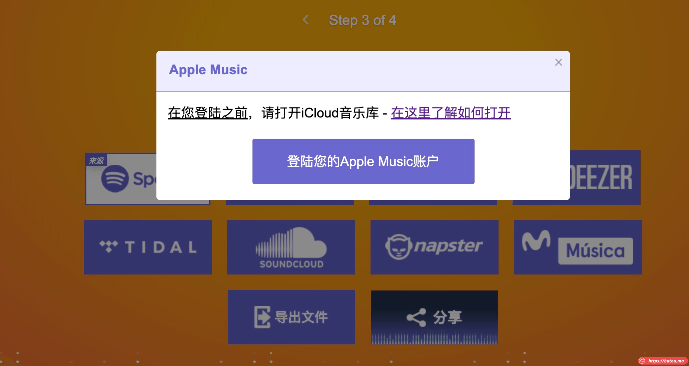
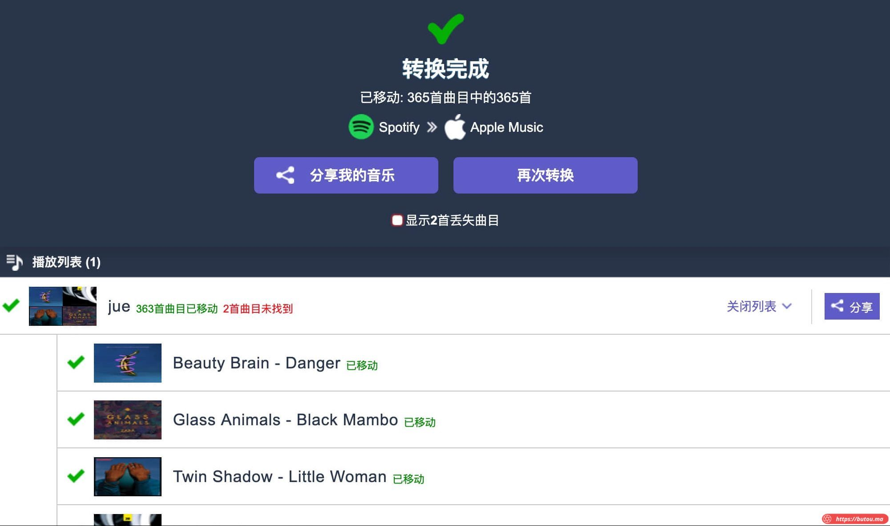

> **起因：刷微博看到黄觉分享了一个 Spotify 歌单二维码，发现评论里好多人没用过 Spotify。反正睡不着，顺手写篇相关教程**。
> 
> 

*   我各种音乐平台都用过，其中网易云重度用户，累计听歌量两万三
*   
*   但网易云在 iPhone 上不能在锁屏后用 Siri 直接唤醒放歌（对 AirPods 支持也不行），故最近转移到 Apple Music 了。（转移了六千首过去）
*   

**也为了防止单一平台版权原因下架，系统研究了一下各平台的迁移方法**

> **先写 Spotify 转 Apple Music，网易云转 Apple Music 复杂些有空再更新。**_**（其余 QQ 音乐 / 虾米音乐之类都比较简单，不一定写了）**_

Spotify 迁移至 Apple Music
=======================

*   以觉哥的歌单为例，先把二维码解析为链接
    *   先用 Spotify 手机端扫描微博那张图，用右上角自带分享功能得到歌单链接：[https://open.spotify.com/user/huangjue6766/playlist/2lfNXg1139huYYskKclWjD?si=whfaAAhjROihSAOYbykDOw](https://open.spotify.com/user/huangjue6766/playlist/2lfNXg1139huYYskKclWjD?si=whfaAAhjROihSAOYbykDOw)

*   打开 tunemymusic 网站，网址 [https://www.tunemymusic.com/zh-cn/](https://www.tunemymusic.com/zh-cn/)
*   点击开始，选择来源为 Spotify
*   

*   **上面的链接贴进去**
*   

*   **然后按照提示，点下一步，选择目的地为 Apple Music**
*   **这一步需要弹到 Apple 网站登录授权（注意授权完成后，这个界面不会自动响应，需要手动再点击下中间这个按钮）**
*   

*   **最后一步，点开始移动，就能一键完成歌单迁移，进度条往后走完后，会提示失败了几首并列出来**
*   

> **注：**
> 
> **选择导入源时，也可以直接导入文本文件**
> 
> **这个网站还支持其他一些平台，步骤都基本一样**